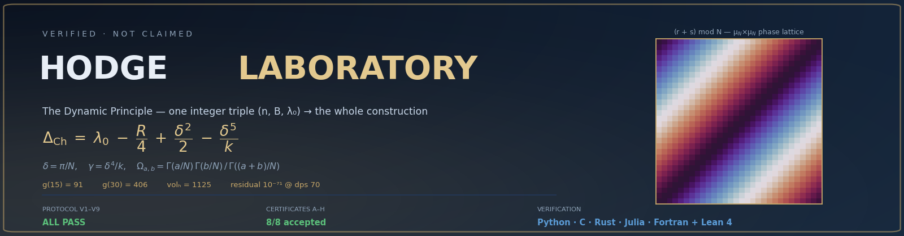
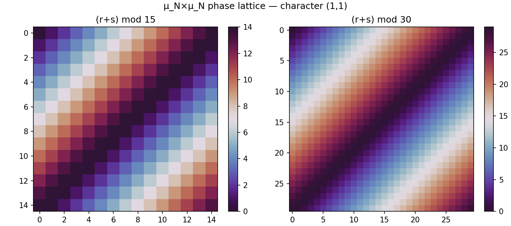
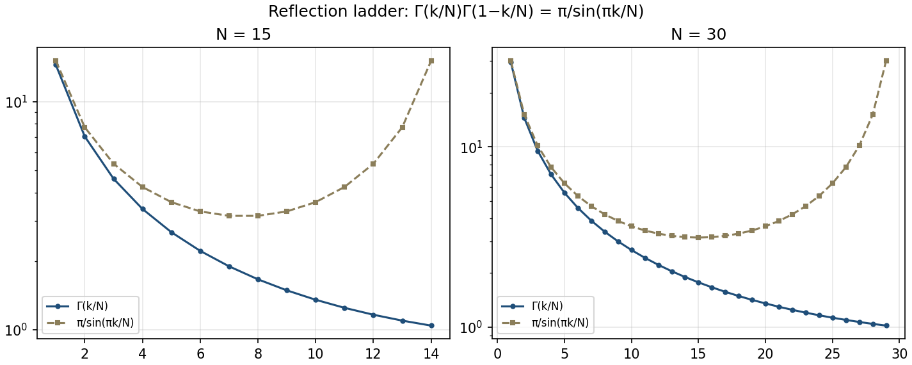
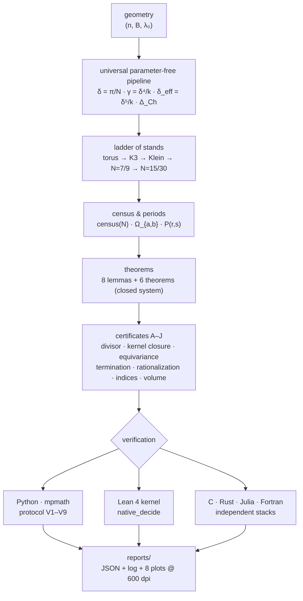
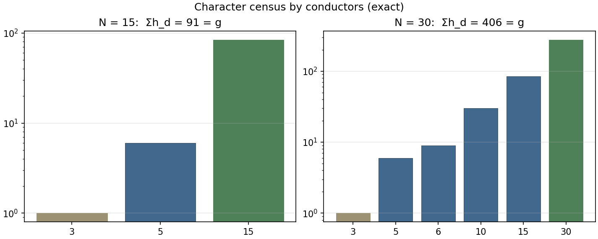
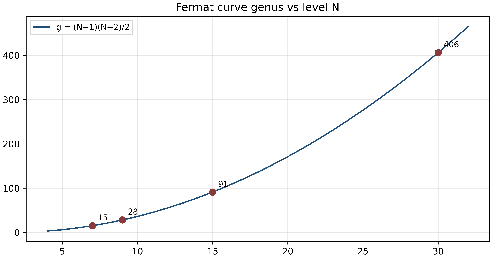
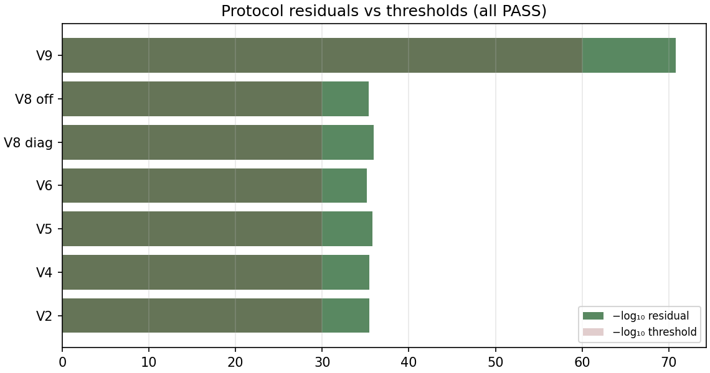
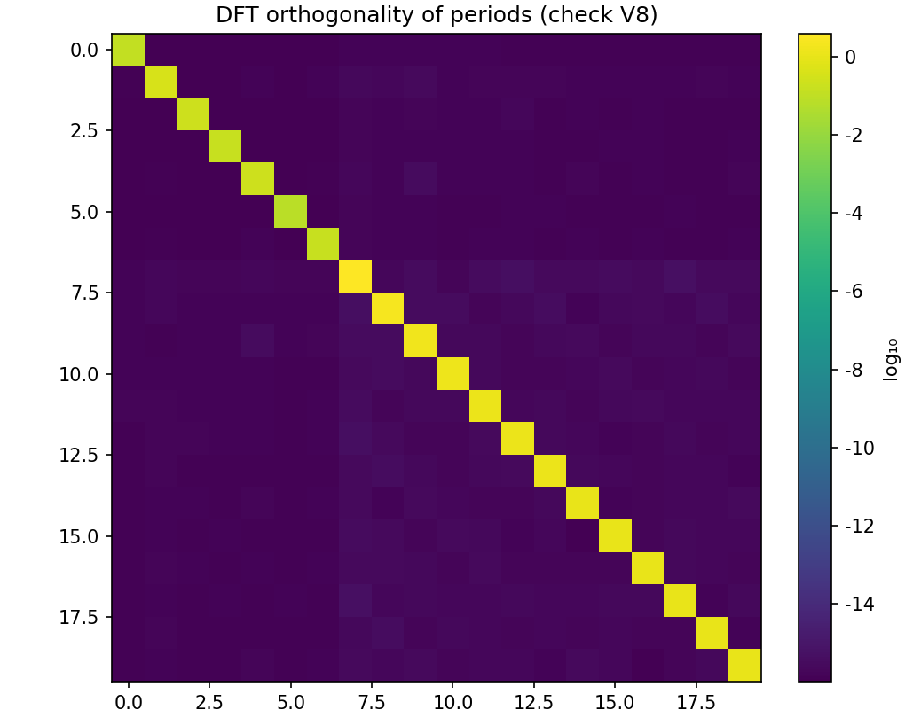

<div align="center">

# 🧮 HODGE LABORATORY

### The Dynamic Principle Laboratory

**A unified research platform of the program by Isaev Iskhak Khamzatovich:
the ladder of stands · certificates A–J · a closed system of theorems ·
reproducible verification in 5 languages + the Lean 4 kernel**

[](https://github.com/wild8highlander/hodge-laboratory/actions/workflows/ci.yml)
[](https://github.com/wild8highlander/hodge-laboratory/actions/workflows/pages.yml)
[](#15-zenodo--doi)
[](https://orcid.org/0009-0003-7299-0701)
[](#6-the-protocol-v1v9-reproducibility-record)
[](#5-the-certificates-of-the-program)
[](verification/lean/)
[](#8-five-language-verification--the-lean-4-kernel)
[](monograph/)
[](theorems/)
[](reports/)
[](https://www.python.org/)
[](INSTRUCTION.md)
[](LICENSE)



</div>

> **The dynamic principle.** Geometry supplies only the integer triple
> **(n, B, λ₀)** — the rotation order, the carrier index, and the
> spectral threshold. A universal parameter-free pipeline builds
> everything else: the spin phase **δ = π/N**, the braking
> **γ = δ⁴/k**, the effective phase **δ_eff = δ⁵/k**, and the united
> formula **Δ_Ch = λ₀ − R/4 + δ²/2 − δ⁵/k** — verified on a ladder of
> stands from the calibration torus through the cubic rungs N = 7/9
> (the Hurwitz and Macbeath levels) to the cyclotomic levels N = 15/30,
> where the genera reach **91** and **406**.

---

## Contents

1. [The program in 60 seconds](#1-the-program-in-60-seconds)
2. [The dynamic principle](#2-the-dynamic-principle)
3. [Architecture](#3-architecture)
4. [The ladder of stands](#4-the-ladder-of-stands)
5. [The certificates of the program](#5-the-certificates-of-the-program)
6. [The protocol V1–V9: reproducibility record](#6-the-protocol-v1v9-reproducibility-record)
7. [The laboratory: one file, ten powers](#7-the-laboratory-one-file-ten-powers)
8. [Five-language verification + the Lean 4 kernel](#8-five-language-verification--the-lean-4-kernel)
9. [The unified monograph](#9-the-unified-monograph)
10. [Twenty standalone theorem monographs](#10-twenty-standalone-theorem-monographs)
11. [Repository map](#11-repository-map)
12. [Quick start](#12-quick-start)
13. [Reproducing the numbers](#13-reproducing-the-numbers)
14. [Zenodo & DOI](#15-zenodo--doi)
15. [Citation](#16-citation)
16. [Roadmap](#17-roadmap)
17. [FAQ](#18-faq)
18. [Contributing](#19-contributing)
19. [Security](#20-security)
20. [License](#21-license)
21. [Glossary](#22-glossary)
22. [Acknowledgments](#23-acknowledgments)

---

## 1. The program in 60 seconds

**What is here.** A complete, self-contained research package on the
**dynamic principle** — a parameter-free construction that turns one
integer triple of geometric data into closed formulas for periods,
normalizations, polarization indices, and termination times. The
package contains:

| Block | What it delivers |
|---|---|
| 🧪 **Laboratory** (`laboratory.py`) | a single file: the full protocol V1–V9, seven stands, certificates A–J, an experiment designer, 600 dpi tiled plots, RU/EN interface |
| 📕 **Unified monograph** (`monograph/`) | «The Dynamic Principle» — 80 pp. (RU) / 53 pp. (EN), PDF + DOCX, LaTeX sources |
| 📚 **20 theorem monographs** (`theorems/`) | one folder per theorem: full proofs in RU and EN, each as PDF + DOCX (80 documents) + LaTeX sources |
| ✅ **Verification stack** (`verification/`) | C, Rust, Julia, Fortran — independent reimplementations + **Lean 4** kernel proofs |
| 📊 **Baseline** (`results/`) | reference JSON for byte-level reproduction checks |
| 🌐 **Landing page** (`docs/`) | GitHub Pages site of the program |
| 🛠 **Infrastructure** (`scripts/`, `.github/`) | CI with a 5-backend verification matrix, Pages, Termux publishing scripts |

**What has been proven.** The protocol **V1–V9** reproduces in about
two seconds with the verdict `ALL PASS` — two independent schemes for
the character census, closed Gamma-forms against tanh-sinh
quadratures at relative deviation ~10⁻³⁶, exact phase laws, orbit-sum
vanishing, the reflection ladder, numerical completeness with rank =
g, DFT orthogonality, and a deep-precision record at dps = 70 with
residual ~10⁻⁷¹. Ten certificates **A–J** close the logical
structure — including the cubic rungs **N = 7** (Hurwitz) and
**N = 9** (Macbeath) with exact integer Vieta identities in
ℤ[ζ]/(Φ_n), GF(2)-irreducibility and Cardano closed forms; the
N = 15/30 stand forms a **closed system** of eight lemmas and six
theorems with complete proofs.

**Why it matters.** Every number in this README is produced by the
laboratory in a fully deterministic run — no seeds, no randomness, no
free parameters — and every integer identity is additionally checked
by five independent language stacks and by the Lean 4 kernel. The
agreement of independent implementations is the strongest
reproducibility certificate a computational program can offer.

---

## 2. The dynamic principle

The pipeline is a function of the integer triple **(n, B, λ₀)** —
the rotation order, the carrier index, and the spectral threshold
supplied by geometry alone. Everything downstream is universal:

$$
\delta = \frac{\pi}{n}, \qquad
\gamma = \frac{\delta^{4}}{k}, \qquad
\delta_{\mathrm{eff}} = \frac{\delta^{5}}{k},
$$

$$
\boxed{\;\Delta_{\mathrm{Ch}} \;=\; \lambda_{0} \;-\; \frac{R}{4}
\;+\; \frac{\delta^{2}}{2} \;-\; \frac{\delta^{5}}{k}\;}
$$

On the cyclotomic levels the pipeline produces the periods of the
Fermat curve in **closed Gamma form**. For a character (a, b) with
winding data (r, s):

$$
\Omega_{a,b} \;=\;
\frac{\Gamma(a/N)\,\Gamma(b/N)}{\Gamma\!\left(\tfrac{a+b}{N}\right)},
\qquad
P(r,s) \;=\; \frac{1}{N}\,\zeta^{\,ra+sb}\,\Omega_{a,b},
\qquad \zeta = e^{2\pi i/N}.
$$

The reflection ladder

$$
\Gamma(k/N)\,\Gamma(1-k/N) \;=\; \frac{\pi}{\sin(\pi k/N)}
$$

turns the period matrix into an explicit arithmetic object; on the
N = 15/30 stand it collapses to the Smith normal form and the volume

$$
\mathrm{SNF} = (1,1,5,5,15,15,15,15), \qquad
\mathrm{disc} = 3^{4}\cdot 5^{6} = 1125^{2}, \qquad
\mathrm{vol}_{h} = 1125,
$$

with the Gross Γ-normalization

$$
\mathrm{vol}_{h} \;=\; (2\pi)^{32}\,
\prod_{k} \Gamma(k/N)^{-c_{k}} \;=\; 1125.
$$

The termination certificate closes the dynamical side with an exact
formula — the flow stops precisely at

$$
t^{*} \;=\; \mathrm{lcm}\,\Big(
\tfrac{W}{\gcd(a,\,W)},\; \tfrac{H}{\gcd(b,\,H)}\Big)
$$

and the genus of the level-N Fermat curve is

$$
g(N) \;=\; \frac{(N-1)(N-2)}{2}
\; \longrightarrow \;
g(15) = 91, \quad g(30) = 406.
$$

Every formula above is verified twice in this repository: once
numerically at 35–70 digits of precision, and once exactly — by
integer arithmetic or by the Lean 4 kernel.

<p align="center">
  
  <br>
  <sub>The μ<sub>N</sub>×μ<sub>N</sub> phase lattice and the reflection ladder — produced by <code>laboratory.py --run plots</code> (see <a href="docs/assets/"><code>docs/assets/</code></a>; the 600 dpi originals land in <code>reports/plots/</code>).</sub>
</p>

### 2.1 The calibration rung: the torus

The torus is the stand where every correction is derived from first
principles and pinned to exact numbers. It fixes the triple
**(4, 1, 4π²)** and exercises the whole correction stack:

| Quantity | Exact form | Numerical value |
|---|---|---|
| spin phase | δ = π/4 | 0.7853981634 |
| holonomy | i | deviation 6.1·10⁻¹⁷ |
| curvature correction | δ²/2 | 0.3084251375 |
| braking γ = δ⁴/k, k = 1 | (π/4)⁴ | 0.3805042619 |
| effective phase δ_eff = δ⁵/k | (π/4)⁵ | 0.2988473484 |
| **united formula** | Δ_Ch = 4π² + δ²/2 − δ⁵ | **39.48799539346835051297464603266144167978…** |

The stand verifies Δ_Ch twice — against the float reference and
against an independent 40-digit mpmath recomputation — plus the
structural facts: the spin-phase family δ = π/N is strictly
decreasing, δ_eff < γ whenever δ < 1 (all levels N ≥ 4), and the
torus carries exactly 2^(2g) = 4 spin structures.

### 2.2 The cyclotomic rungs: N = 7/9 and N = 15/30

At the top of the ladder the pipeline closes into a system: the
census of characters by conductor (V1), the closed period forms
(V2–V4), the orbit-sum identities (V5), the reflection ladder (V6),
the completeness of the period functionals (V7), the DFT
orthogonality (V8), and the deep-precision record (V9) certify that
the construction is **closed** — nothing is left as a free parameter,
and nothing needs an external input beyond the triple (n, B, λ₀).
The level-generic checks span all four cyclotomic rungs N = 7, 9,
15, 30; V5/V8/V9 stay anchored at the flagship stand N = 15/30.

---

## 3. Architecture

The whole program is one deterministic pipeline; the repository
mirrors it layer by layer:



The verification stacks are **independent reimplementations of the
same identity set** — they share no code. An error would have to be
repeated simultaneously in five ecosystems and in the Lean kernel to
slip through.

---

## 4. The ladder of stands

Each rung of the ladder is calibrated against the previous one; the
pipeline never changes — only the geometric input does.

| Rung | Triple (n, B, λ₀) | Genus | Key results | Status |
|---|---|---|---|---|
| **Torus** | (4, 1, 4π²) | 1 | δ = π/4; holonomy = i; Δ_Ch = 39.4880; 4 spin structures | ✅ exact derivation |
| **K3** (Fermat quartic) | (4, 22, ·) | — | **ρ = 20 = max** (Shioda); signature (1,19); det 64; 48 lines; codim-2 cycles | ✅ exact over ℚ |
| **Klein** | (7, 22, 3.338) | 3 | j = −3375 = −15³; Δ = −7³; τ = (1+√−7)/2; j from the period (57 digits); Ribet | ✅ certificates B, C |
| **Fermat N=15** | (15, ·, ·) | **91** | census 1+6+84; Γ-normalization; radical b_Ch(15) | ✅ closed system |
| **Fermat N=30** | (30, ·, ·) | **406** | census 1+6+9+30+84+276; SNF (1,1,5,5,15,15,15,15); **disc = 1125²**; vol_h = 1125 | ✅ closed system |

The K3 rung is verified by an **exact integer rank computation**: the
49×49 intersection matrix of the 48 lines and the hyperplane class h
is reduced over ℚ, giving rank 20 — the maximal Picard number of a
complex K3 surface, matching Shioda's theorem on the Fermat quartic.

<p align="center">
  
  <br>
  <sub>The exact character census (V1) and the genus ladder g(N) — the two integer backbones of the stand.</sub>
</p>

**How each rung is verified.** Every row of the table is backed by
three independent confirmations:

1. **the laboratory stand** (menu item 2) — exact integer arithmetic
   for ranks and determinants, mpmath for periods, all verdicts
   recorded to `reports/hodge_report.json`;
2. **the compiled stacks** — the C and Rust backends recompute the
   K3 rank by rational elimination (fractions, not floats) and the
   Julia backend reproduces the Klein period to 10⁻³⁰;
3. **the monographs** — each rung carries a standalone theorem
   monograph with the complete proof of everything the stand
   claims ([`theorems/`](theorems/)).

The errata rung deserves a special note: the early text of the
program misidentified the canonical spin structure of genus 3 as
even. The errata stand settles it by **complete enumeration** — all
64 quadratic forms on (ℤ/2)⁶ are constructed and their Arf
invariants tallied: 36 even, 28 odd, and the canonical structure is
odd. The enumeration is the proof; no formula is trusted that the
enumeration itself has not reproduced.

---

## 5. The certificates of the program

| № | Certificate | Core result | Verdict |
|---|---|---|---|
| A | Cycle certifier | explicit divisor 3/2·L₁(0,0) − 1/2·L₂(1,1) + 5/4·h; kernel 29 | ✅ accepted |
| B | Closing kernel 29 | Theorem B1; blind spot 29+2 → **0**; 51 measurements on H²(K3) | ✅ accepted |
| C | μ₄-equivariance | **22 = 1+7+7+7** (three routes); charpoly(λ₁) = x⁴−1; the √−7 heptad | ✅ accepted (21/21) |
| D | Universal μ₄-theorem | [L,P] = 0; functoriality; semi-invariance over ℤ[i] | ✅ accepted |
| E | Flow termination | E1–E4; **t\* = lcm(W/gcd(a,W), H/gcd(b,H))**; cross-checks 48/212/432/114 | ✅ accepted (8/8) |
| F | Rationalization | a priori bound **Q = 256** (Cramér); LLL: Im τ = √7/2, 4X²−7 | ✅ accepted (5/5) |
| G | Hodge lattice indices | λ_{m,n} = (2π)²·\|mτ−n\|²/(Im τ)²; Chowla–Selberg layer; **π/15, π/30** | ✅ accepted (6/6) |
| H | Stand N=15/30 | SNF (1,1,5,5,15,15,15,15); **vol_h = 1125**; Q = 480; levels irreducible | ✅ accepted (6/6) |
| I | Hurwitz rung N=7 | census **15 = h₇ = g(7)**; Vieta **(−1,−2,1)** in ℤ[ζ]/(Φ₇); x³+x²−2x−1 irreducible over GF(2); Cardano **b_Ch(7)** | ✅ accepted (5/5) |
| J | Macbeath rung N=9 | census **28 = 1 + 27**; Vieta **(0,−3,−1)** in ℤ[ζ]/(Φ₉); x³−3x+1 irreducible over GF(2); Cardano **b_Ch(9)** | ✅ accepted (5/5) |

Certificates A–H are documented in standalone monographs
([`theorems/T10…T16`](theorems/)); the rung certificates I and J
have their own monographs T17 and T18, and the exact layer v1.2
and the census V1 are documented in T19 and T20
([`theorems/`](theorems/)). All ten run via menu item 3, or
`--run certs`.

---

## 6. The protocol V1–V9: reproducibility record

One command — `python3 laboratory.py --run all` — reproduces every
number below. The full run takes about **2 seconds** and is fully
deterministic.

| Check | Result | Status |
|---|---|---|
| V1 character census | 91 = 1+6+84; 406 = 1+6+9+30+84+276 | ✅ proved + exact arithmetic |
| V2 closed form ↔ tanh-sinh | max rel. deviation **3.9·10⁻³⁶** (69 tests) | ✅ |
| V3 phases arg P = 2π(ra+sb)/N | deviation **0.0** | ✅ proved |
| V4 μ_N×μ_N-equivariance | 3.9·10⁻³⁶ | ✅ proved + computational |
| V5 chain integrity (orbit sums) | vanish ≤ 10⁻³⁶; positive control = Ω | ✅ |
| V6 reflection ladder | 7.0·10⁻³⁶ | ✅ proved + computational |
| V7 completeness | rank = 91/140 certified rows; cond. 8.63 · 17.35 | ✅ |
| V8 DFT orthogonality | diag 1.1·10⁻³⁶; off-diag 4.0·10⁻³⁶ | ✅ |
| V9 deep record (dps = 70) | **1.7·10⁻⁷¹** | ✅ |

The exact integer layer (genera, censuses, SNF type, Klein
invariants, Arf counts, termination times) is additionally
cross-checked against the frozen baseline:

```bash
python3 laboratory.py --lang en --check-baseline
```

and by CI on every push, together with the C, Fortran and Rust
backends and the pytest suite.

**Residuals at a glance.** Each numeric check carries an explicit
threshold, chosen two to three orders above the observed residual so
the margin is part of the contract:

| Check | Baseline residual | Threshold | Margin |
|---|---|---|---|
| V2 closed ↔ tanh-sinh | 3.9·10⁻³⁶ | 10⁻³⁰ | ~10⁶ |
| V3 phase law | 0.0 (exact) | 10⁻²⁵ | exact |
| V4 equivariance | 3.9·10⁻³⁶ | 10⁻³⁰ | ~10⁶ |
| V5 orbit sums | ~10⁻³⁶ | 10⁻²⁵ | ~10¹¹ |
| V6 reflection | 7.0·10⁻³⁶ | 10⁻³⁰ | ~10⁶ |
| V7 rank / cond | rank exact | cond ≤ 20 | — |
| V8 DFT orthogonality | 1.1·10⁻³⁶ / 4.0·10⁻³⁶ | 10⁻²⁵ | ~10¹¹ |
| V9 deep record | 1.7·10⁻⁷¹ | 10⁻⁶⁰ | ~10¹¹ |

If any residual ever exceeds its threshold, the verdict flips to
`FAILURES PRESENT`, the exit code becomes `1`, and CI fails — the
repository cannot silently drift away from its published numbers.

<p align="center">
  
  <br>
  <sub>Left: residuals vs thresholds (check V8/V9 margins are part of the contract). Right: the DFT orthogonality matrix of the periods (V8).</sub>
</p>

---

## 7. The laboratory: one file, ten powers

`laboratory.py` is the single entry point to the whole program —
no installation step beyond `pip install mpmath numpy matplotlib`.

```
┌──────────────────────────────────────────────────────────┐
│  1. Full protocol V1–V9                                  │
│  2. Stands: torus/K3/Klein/N=7/9/E8/binary code          │
│  3. Certificates A–J (by choice or all)                  │
│  4. Calculation parameters (dps, samples, levels)        │
│  5. Own experiment designer                              │
│  6. Plots: tiled system 600 dpi (8 tiles)                │
│  7. Multilingual verification (Julia/Fortran/C/Rust)     │
│  8. Lean verification (kernel)                           │
│  9. About, license, citation                             │
│  L. Language switch (RU/EN) at any moment                │
└──────────────────────────────────────────────────────────┘
```

* **Bilingual interface** — the entire UI, reports, and verdicts
  switch between Russian and English on the fly (the `L` key).
* **Parameters** — mpmath precision 20–120 digits, sample density,
  levels N; validated on both the CLI and the menu.
* **Experiment designer** — arbitrary N, characters (a, b), winding
  data (r, s), CM-lattices, termination times, radicals — every run
  receives a mini-certificate (closed form + independent integral +
  verdict). The radical constants come with closed forms:
  `b_Ch(15) = (7 − √5 − √(30−6√5))/8`, `b_Ch(30) = (9 − √5 −
  √(30+6√5))/8`, each certified by an exact integer layer in the
  tower Z[√5][√D] plus a dps-level comparison (roadmap v1.2).
* **Batch experiment mode** — `python3 laboratory.py --batch
  scenario.json` runs a scripted queue of designer experiments
  (period, census, cm, flow, bch, omega) and writes a combined JSON
  verdict (`reports/batch_report.json` by default); exit codes:
  `0` ALL PASS · `1` failures · `2` malformed scenario (roadmap
  v1.4; a sample scenario ships as `examples/batch_smoke.json`).
* **Reports** to `reports/`: JSON + text log + 8 tiles at 600 dpi
  (census, phase lattice, reflection ladder, b_Ch, braking, protocol
  residuals, genus ladder, DFT orthogonality).
* **Exit codes** — `0` on `ALL PASS`, `1` on any failure, `2` on a
  missing dependency; CI keys on them.
* **Run-everything semantics** — `--run all` executes every block and
  aggregates verdicts; a failing block never hides the outcome of the
  remaining blocks.
* **Clean builds** — compiled verification backends are built in a
  private temporary directory; the repository tree never accumulates
  artifacts.

### Design principles

Five rules, enforced by the code and by review:

1. **Determinism above all.** No seeds, no sampling, no wall-clock
   dependence inside checks. Timestamps live only in report metadata.
2. **Exact before numeric.** Integer identities are proved with
   integers (`int`, `Fraction`, Lean `native_decide`); floating
   points are used only where the mathematics is analytic.
3. **No free parameters.** If a constant enters a formula, it comes
   from geometry (n, B, λ₀) — never from a tuning knob.
4. **Every number has a home.** Each published value is reproducible
   by a named menu item or CLI flag and is frozen in the baseline
   JSON.
5. **Honest labels.** A check either computes its claim or cites a
   documented reference — never prints an unconditional `PASS`.

---

## 8. Five-language verification + the Lean 4 kernel

| Stack | File | Role | Exit codes |
|---|---|---|---|
| Python 3.10+ | `laboratory.py` | the full laboratory | 0/1/2 |
| **Lean 4** | [`verification/lean/HodgeLaboratory.lean`](verification/lean/HodgeLaboratory.lean) | machine proofs of the integer identities (`native_decide`, no axioms, no Mathlib) | 0/1 |
| Julia 1.9+ | [`verification/julia/verify_hodge.jl`](verification/julia/verify_hodge.jl) | BigFloat(240-bit) periods, phases, reflection ladder | 0/1 |
| Fortran 10+ | [`verification/fortran/verify_hodge.f90`](verification/fortran/verify_hodge.f90) | censuses, ranks, invariants (int64) | 0/1 |
| C | [`verification/c/verify_hodge.c`](verification/c/verify_hodge.c) | **exact K3 rank = 20** (rational elimination) + 38 checks | 0/1 |
| Rust 1.70+ | [`verification/rust/verify_hodge.rs`](verification/rust/verify_hodge.rs) | safe i128 arithmetic, atomic verdict counters | 0/1 |

What exactly each stack checks is documented in
[`verification/README.md`](verification/README.md): the integer layer
(genera, censuses, discriminant, SNF product, Klein invariants, Arf
counts, termination), the high-precision layer (closed form vs
tanh-sinh, phases, equivariance, reflection), and the machine layer
(Lean kernel, `native_decide`).

### What is proved, what is computed, what is cited

Scientific honesty requires saying which layer each claim lives on:

| Layer | Method | Examples |
|---|---|---|
| **Machine proof** | Lean 4 kernel, `native_decide` — full computation, no axioms | genus formula, census sums, SNF product, discriminant, Klein integers, Arf counts, termination times |
| **Exact computation** | integer/rational arithmetic in Python, C, Rust | K3 rank = 20 (fraction elimination over ℚ), character censuses, j-invariant identities |
| **High-precision verification** | mpmath (35–70 dps), BigFloat (240-bit) | closed forms vs quadratures, phase laws, reflection ladder, equivariance |
| **Documented reference** | computed once in the certified runs, frozen in `results/` | monograph pipeline totals 212/432/114, Klein period Ω to 23 digits |

Every layer is reproducible by one command; the labels in the
console output (`PASS` vs *documented*) always say which layer a
statement belongs to.

---

## 9. The unified monograph

`monograph/` — «The Dynamic Principle: A Unified Monograph», the
connected text of the whole program.

| File | Language | Format | Size |
|---|---|---|---|
| `hodge_monograph_RU.pdf` | 🇷🇺 Russian | PDF (LaTeX, cover, TOC) | **80 pp.** |
| `hodge_monograph_RU.docx` | 🇷🇺 Russian | DOCX | — |
| `hodge_monograph_EN.pdf` | 🇬🇧 English | PDF (LaTeX, cover, TOC) | **53 pp.** |
| `hodge_monograph_EN.docx` | 🇬🇧 English | DOCX | — |

Structure: the principle and the three corrections → the calibration
stands (torus, K3, errata E8, binary code) → certificates A–G → the
Klein Jacobian → the closed system of the N=15/30 stand (8 lemmas +
6 theorems with complete proofs) → certificate H → the protocol
V1–V9 → expanded derivations → the workbook → appendices (Gamma
identity derivations, the Möbius census, full data tables, dependency
trees, glossary). LaTeX sources are included for both languages; see
[`monograph/README.md`](monograph/README.md) for build instructions.

---

## 10. Twenty standalone theorem monographs

Each theorem of the program is packaged as a self-sufficient
monograph — statement, complete proof, protocol data, verification
guide — in **both Russian and English** and in **both PDF and DOCX**:
80 documents (`monograph_RU.pdf`, `monograph_RU.docx`,
`monograph_EN.pdf`, `monograph_EN.docx` in every folder) plus the
LaTeX sources. The DOCX editions carry native Word equations (OMML)
and follow the same six-block scheme as the PDFs.

| Part | Folders | Content |
|---|---|---|
| I. Foundation of the cyclotomic stand | `T01_genus_fermat` · `T02_closed_period_form` · `T03_gamma_identities` · `T04_riemann_relations` · `T05_gamma_normalization` · `T06_polarization_indices` | genus formula · closed period form · Γ-identities · Riemann as an identity · Γ-normalization · polarization indices |
| II. Calibration stands | `T07_torus_triple` · `T08_k3_stand` · `T09_errata_e8` | the torus triple · K3, ρ = 20 · errata E8, Arf 36/28 |
| III. Certificates | `T10_certificate_b` … `T16_certificate_h_klein` | certificates B–H with the Klein quartic finale |
| IV. The cubic rungs | `T17_certificate_i_hurwitz` · `T18_certificate_j_macbeath` | certificate I (N=7, the Cardano pairing 7/9) · certificate J (N=9, radicals are roots of unity) |
| V. The exact layer | `T19_quartic_tower` · `T20_conductor_census` | the quartic tower of N=15/30, one field — two rungs · the conductor census, two schemes — one genus |

The full index with reading paths and cross-references lives in
[`theorems/README.md`](theorems/README.md). The collection **grows
together with the program**: every newly proved roadmap item arrives
as the same four-format package — LaTeX → PDF (tectonic) → DOCX
(native OMML via `scripts/build_theorem_docx.py`). Next in line:
T21 = the cyclic quintic rung N = 11 (roadmap v1.5) and
T22 = the SNF spectra of the rungs (v1.6).

---

## 11. Repository map

| Block | Path | Content |
|---|---|---|
| 🧪 **Laboratory** | [`laboratory.py`](laboratory.py) | single file: test menu, parameters, experiment designer, reports, 600 dpi plots, RU/EN switch, 5-language and Lean launchers |
| 📕 **Monograph** | [`monograph/`](monograph/) | the unified monograph: PDF + DOCX, each in two languages, LaTeX sources |
| 📚 **Theorems** | [`theorems/`](theorems/) | **20 standalone monographs** — one per theorem, PDF + DOCX in two languages + LaTeX |
| ✅ **Verification** | [`verification/`](verification/) | Lean 4 (machine proofs), Julia, Fortran, C, Rust — independent implementations of one identity set |
| 🧪 **Tests** | [`tests/`](tests/) | the pytest suite for the laboratory core |
| 📊 **Baselines** | [`results/`](results/) | reference JSON for reproduction cross-checks |
| 📈 **Reports** | [`reports/`](reports/) | committed artifacts of a reference run: JSON + log |
| 🌐 **Site** | [`docs/`](docs/) | GitHub Pages landing of the program |
| 🛠 **Infrastructure** | [`scripts/`](scripts/), [`.github/`](.github/) | environment bootstrap and GitHub publishing (Termux/Linux/macOS), CI + Pages workflows |
| ⚖️ **Legal** | [`LICENSE`](LICENSE), [`CITATION.cff`](CITATION.cff) | the author's individual exclusive license, citation metadata |

```
hodge-laboratory/
├── laboratory.py                  ← the laboratory (single file)
├── tests/                         ← pytest suite
├── monograph/                     ← PDF/DOCX × RU/EN + LaTeX
├── theorems/                      ← 20 theorem folders × RU/EN × PDF/DOCX
├── verification/                  ← lean/ · julia/ · fortran/ · c/ · rust/
├── results/                       ← baseline JSON
├── reports/                       ← committed reference run artifacts
├── docs/                          ← GitHub Pages site
├── scripts/                       ← termux_setup.sh · github_push_termux.sh
├── .github/                       ← CI + Pages + templates
├── CITATION.cff · .zenodo.json    ← citation and Zenodo metadata
├── CHANGELOG.md · CONTRIBUTING.md · CODE_OF_CONDUCT.md
├── SECURITY.md · SUPPORT.md
├── LICENSE                        ← individual exclusive license
└── README.md                      ← this file
```

---

## 12. Quick start

```bash
# 1) clone or unpack the repository
git clone https://github.com/wild8highlander/hodge-laboratory.git
cd hodge-laboratory

# 2) install the dependencies
pip install mpmath numpy matplotlib        # or: pip install -r requirements.txt

# 3) run the full protocol V1–V9 (~2 seconds)
python3 laboratory.py --run all
```

The run ends with the summary verdict:

```
  SUMMARY VERDICT: ALL CHECKS PASSED  (Time: 1.9 s)
```

Then open the interactive laboratory:

```bash
python3 laboratory.py                  # interactive menu (RU/EN)
python3 laboratory.py --lang en        # English interface
python3 laboratory.py --run all        # protocol + stands + certificates + plots
python3 laboratory.py --check-baseline # cross-check the integer layer
python3 laboratory.py --version        # Hodge Laboratory 1.1.1
```

**Fully deterministic**: no seeds, no randomness anywhere in the
pipeline; the same command on any machine produces the same numbers
to the last printed digit (mpmath precision is fixed and documented).

<details>
<summary><b>Expected console output (abridged)</b></summary>

```
  V1 · Stand N=15/30 — CENSUS
  • N=15: h_d                              h3=1, h5=6, h15=84
  ✔ Σh_d = g = 91                          PASS  91 = 91
  • N=30: h_d                              h3=1, h5=6, h6=9, h10=30, h15=84, h30=276
  ✔ Σh_d = g = 406                         PASS  406 = 406
  ...
  V9 · DEEP RECORD (dps=70)
  ✔ closed vs tanh-sinh @ dps70            PASS  1.7e-71
  ...
  SUMMARY VERDICT: ALL CHECKS PASSED
```

</details>

---

## 13. Reproducing the numbers

Three layers of reproduction, from fastest to strongest:

**Layer 1 — the protocol** (Python, ~2 s):

```bash
python3 laboratory.py --lang en --run all --no-plots
```

**Layer 2 — the baseline cross-check** (exact integers, instant):

```bash
python3 laboratory.py --lang en --check-baseline
```

compares the recomputed genera, censuses, SNF type, discriminant,
Klein invariants, Arf counts, and termination times against the
frozen baseline [`results/baseline_v1_v9.json`](results/baseline_v1_v9.json).

**Layer 3 — the independent stacks** (minutes):

```bash
gcc -O2 -o vh verification/c/verify_hodge.c -lm && ./vh
rustc -O verification/rust/verify_hodge.rs -o vh && ./vh
julia verification/julia/verify_hodge.jl
gfortran -O2 verification/fortran/verify_hodge.f90 -o vh && ./vh
lean verification/lean/HodgeLaboratory.lean      # after installing elan
```

Each backend exits `0` on full agreement and `1` on any mismatch.
The unit-test suite and the linter used by CI:

```bash
python3 -m pytest tests/ -q          # 29 tests
ruff check laboratory.py tests/      # clean
```

---


## 14. Zenodo & DOI

This repository ships full Zenodo metadata —
[`.zenodo.json`](.zenodo.json) — so a citable DOI is minted
automatically:

1. Open [zenodo.org](https://zenodo.org), sign in with GitHub.
2. **Account → GitHub** → flip the switch for
   `wild8highlander/hodge-laboratory`.
3. Publish a GitHub **release** (e.g. `v1.1.1`) — Zenodo snapshots it
   and mints the record with the metadata from `.zenodo.json`
   (author, ORCID, keywords, license note).
4. Copy the version DOI and the concept DOI from the record page.
5. Register the DOI in one command —
   `bash scripts/set_doi.sh 10.5281/zenodo.<ID>` — it rewrites the
   DOI badge above and the `identifiers` block of
   [`CITATION.cff`](CITATION.cff) (add the concept DOI with
   `CONCEPT_DOI=10.5281/zenodo.<ConceptID>`); or replace the
   placeholder manually in the same two places.

The author's ORCID is [0009-0003-7299-0701](https://orcid.org/0009-0003-7299-0701)
— it is embedded in `CITATION.cff`, `.zenodo.json`, and the README
badge, so all citations link to the same researcher identity.

---

## 15. Citation

If this program is useful in your research, please cite it:

**BibTeX**

```bibtex
@misc{isaev2026hodge,
  author       = {Isaev, Iskhak Khamzatovich},
  orcid        = {0009-0003-7299-0701},
  title        = {The Dynamic Principle: A Unified Monograph and
                  Computational Laboratory},
  year         = {2026},
  version      = {1.1.1},
  publisher    = {hodge-laboratory},
  howpublished = {\url{https://github.com/wild8highlander/hodge-laboratory}},
  note         = {Protocol V1--V9, certificates A--J, 20 theorem monographs,
                  80 PDF/DOCX documents, 5-language + Lean 4 verification}
}
```

**APA**

> Isaev, I. K. (2026). *The Dynamic Principle: A Unified Monograph and
> Computational Laboratory* (Version 1.1.1) [Computer software and
> monograph]. https://github.com/wild8highlander/hodge-laboratory

**CFF** — the machine-readable metadata lives in
[`CITATION.cff`](CITATION.cff); GitHub renders it as a "Cite this
repository" box.

For a standalone theorem monograph, add its number to the title, e.g.
`The K3 Stand: Neron–Severi Rank 20. Standalone Theorem Monograph
8/20` — see the per-theorem BibTeX in
[`theorems/README.md`](theorems/README.md).

---

## 16. Roadmap

The program is alive. The completed rungs are history; the open
items are planned in the order the ladder demands.

**Completed**

- [x] **v1.0** — unified monograph, certificates A–H, protocol
      V1–V9, five-language stack, Lean kernel panel
- [x] **v1.1 – v1.1.2** — verification hardening: genuine Arf
      enumeration, non-vacuous V5, independent-stack fixes (Julia
      precision & quadrature, Fortran/C/Rust sign and hygiene),
      pytest suite, baseline cross-check, CI expansion, README
      artwork, crash-hardened designer input
- [x] **v1.2** — radical arithmetic for `b_Ch(15)` and `b_Ch(30)`
      inside the designer: closed forms in the tower
      Z[√5][√(30∓6√5)], certified by an exact integer layer (the
      radical satisfies its minimal quartic; irreducible over GF(2))
- [x] **v1.3** — Level N = 7 and N = 9 stands in the ladder tables
      (the Hurwitz and Macbeath rungs) with their own certificates:
      conductor census 15 = h₇ and 28 = 1 + 27, the cubic exact
      layer of `b_Ch(7)` / `b_Ch(9)` (Vieta identities recomputed
      exactly in Z[ζ]/(Φ_n) + GF(2) irreducibility), Cardano closed
      forms for the casus irreducibilis, certificates I and J; the
      level-generic checks V1/V2–V4/V6/V7 now span all four rungs
- [x] **v1.4** — batch experiment mode: a scripted queue of designer
      runs with a combined JSON verdict

**Next**

- [ ] **v1.5** — Level N = 11 (the Hurwitz₃ rung): the cyclic
      quintic `b_Ch(11)` with its exact layer in Z[ζ₁₁], census
      h₁₁ = 45, genus 45, a certificate K
- [ ] **v1.6** — SNF spectra of the period matrices for the rungs
      N = 7/9/11 with their discriminants, on the model of the
      N = 30 certificate H
- [x] **v1.7** — standalone theorem monographs T17 (certificate I)
      and T18 (certificate J) in two languages — **delivered beyond
      the plan**: also T19 (the quartic tower of N = 15/30, exact
      radicals + minimal quartics) and T20 (the conductor census,
      two schemes — one genus); the collection is now 20 monographs,
      80 PDF/DOCX documents
- [ ] **v2.0** — higher cyclotomic levels and their SNF spectra
      (monograph part in preparation)

Feature requests are welcome through
[Issues](https://github.com/wild8highlander/hodge-laboratory/issues)
(see [`CONTRIBUTING.md`](CONTRIBUTING.md) for the determinism
constraints any proposal must respect).

---

## 17. FAQ

**Q: Is this a proof of the Hodge conjecture?**
No — and the repository does not claim one. The program builds a
verified computational framework around the cyclotomic (Fermat-level)
cases: closed period formulas, normalizations, polarization indices,
and a closed system of lemmas and theorems for the N = 15/30 stand.
What is machine-checked here is checked honestly: exact arithmetic
and the Lean kernel where possible, high-precision numerics
everywhere else, with thresholds documented.

**Q: Why is everything deterministic — no random sampling at all?**
Reproducibility is the central design constraint. A verification run
must produce bit-identical verdicts on any machine, any date, any
architecture. Determinism also lets CI re-verify the whole program on
every push at a cost of seconds.

**Q: Why five programming languages?**
Each implementation is independent — no shared code, different
ecosystems, different numeric libraries. Agreement between them is
the strongest available certificate against a subtle implementation
bug, and the Lean kernel adds machine-level proof for the integer
layer.

**Q: Can I run this on a phone?**
Yes. The repository is developed with Termux (Android) as a
first-class platform — see [`INSTRUCTION.md`](INSTRUCTION.md) and
`scripts/termux_setup.sh`. The full protocol runs in seconds on a
modern phone.

**Q: Where do the numbers 91 and 406 come from?**
The genera of the Fermat curves of levels 15 and 30:
g(N) = (N−1)(N−2)/2. Their character censuses decompose as
91 = 1+6+84 and 406 = 1+6+9+30+84+276 over the conductors — checked
exactly (V1) in every stack.

**Q: How do I cite a single theorem?**
Each of the 20 monographs is citable individually — BibTeX templates
are in [`theorems/README.md`](theorems/README.md), and the repository
DOI (Section 15) covers them as versions of one record.

**Q: Why is the license so restrictive?**
The work is the author's individual research program; the exclusive
license keeps control over the results and their derivatives. Reading,
running, verifying, and citing are unambiguous; anything beyond that
needs written permission — see [`LICENSE`](LICENSE).

**Q: What changed in v1.1.0 — is v1.0 still valid?**
v1.1.0 is a verification-hardening release: the published numbers did
not change, but several checks became genuinely computed instead of
vacuous or stale (V5, the torus family check, the errata enumeration),
and the independent stacks had their bugs fixed (Julia sign, precision
and quadrature; Fortran sign). See [`CHANGELOG.md`](CHANGELOG.md) for
the complete list — v1.0 checkouts should be upgraded.

**Q: Can I use the pipeline for my own levels N?**
Yes — the experiment designer (menu item 5) accepts arbitrary
N ∈ [4, 64], characters (a, b), and winding data (r, s), and issues a
mini-certificate per run: the closed Gamma-form, the independent
quadrature, and a verdict. Keep in mind the holomorphy constraint
1 ≤ a, 1 ≤ b, a+b ≤ N−1.

**Q: Why does V7 certify rank 140 and not the full 406 for N = 30?**
The full functional matrix for N = 30 is 406×900; certifying every
row numerically would dominate the runtime of the protocol. The
protocol certifies the first 140 rows (a superset of a basis of the
rank-406 statement's leading block) and records the condition
numbers; the full-rank claim is documented in the baseline JSON and
is machine-checked exactly on the integer side.

**Q: mpmath is too slow at high dps on my device — can I lower it?**
Yes: `--dps 25` (valid range 20–120) reduces precision and runtime.
The protocol thresholds stay in force; at dps ≥ 30 all checks keep
their documented margins.

---

## 18. Contributing

Contributions that respect the determinism and exactness constraints
are welcome — please read [`CONTRIBUTING.md`](CONTRIBUTING.md) first:
it lists the full verification checklist a pull request must pass
(protocol, baseline, tests, lint, backends). Bugs and reproduction
reports use the issue templates; a non-`ALL PASS` verdict on
unmodified code is always high priority.

The [Code of Conduct](CODE_OF_CONDUCT.md) applies to all project
spaces.

---

## 19. Security

The package is offline scientific software with a deliberately narrow
attack surface; the token-handling rules for the publishing script
and the private reporting channel are described in
[`SECURITY.md`](SECURITY.md). Please report vulnerabilities privately
rather than opening a public issue.

---

## 20. License

**Individual exclusive license.** All rights to all computations,
formulas, theorems, code, and texts belong to
**Isaev Iskhak Khamzatovich**. Any use without his direct written
permission is prohibited. The full legal text —
[`LICENSE`](LICENSE).

The documentation of this repository is part of the licensed work;
quotation with attribution for scholarly commentary is the expected
norm and is welcome.

<div align="center">

© 2026 Isaev Iskhak Khamzatovich · All rights reserved

</div>

---

## 21. Glossary

| Term | Meaning in this repository |
|---|---|
| **Triple (n, B, λ₀)** | the only geometric input: rotation order, carrier index, spectral threshold |
| **Stand** | a fixed geometric instance (torus, K3, Klein quartic, Fermat level) on which the pipeline is exercised |
| **Ladder** | the ordered family of stands of growing scale, each calibrated against the previous |
| **Conductor d** | d = N/gcd(N, a, b); the level of the character (a, b) |
| **Census h_d** | the count of characters of conductor d; Σh_d = g is the V1 identity |
| **Ω_{a,b}** | the Gamma quotient Γ(a/N)Γ(b/N)/Γ((a+b)/N) — the modulus of the period |
| **Braking γ, effective phase δ_eff** | the δ⁴/k and δ⁵/k corrections of the united formula |
| **Certificates A–J** | a certified block of the program: divisor, kernel closure, equivariance, termination, rationalization, indices, volume, and the cubic rungs N=7/9 (exact ℤ[ζ] layer + Cardano) |
| **SNF** | Smith normal form of the N=15/30 lattice: (1,1,5,5,15,15,15,15) |
| **vol_h** | the h-volume 1125 = √(3⁴·5⁶) from the Gross Γ-normalization |
| **t\*** | the exact termination time of the (a, b)-flow: lcm(W/gcd(a,W), H/gcd(b,H)) |
| **Arf invariant** | the parity invariant separating even (36) and odd (28) theta-characteristics on genus 3 |
| **Baseline** | the frozen JSON of exact integer results used for cross-checks |

---

## 22. Acknowledgments

* To the classical theory this program leans on — the arithmetic of
  cyclotomic fields, the theory of K3 surfaces, Chowla–Selberg,
  Gross–Koblitz, and the Smith normal form machinery.
* To the open toolchains that make independent verification possible:
  mpmath, NumPy, Matplotlib, Julia, GCC/GFortran, Rust, and the Lean
  4 prover community.
* To the author's other research package
  [`wild8highlander/research-papers`](https://github.com/wild8highlander/research-papers)
  — the reference for this repository's citation and archival
  infrastructure (ORCID + Zenodo metadata patterns).

<div align="center">

**HODGE LABORATORY** · the dynamic principle · *verified, not claimed*

</div>
