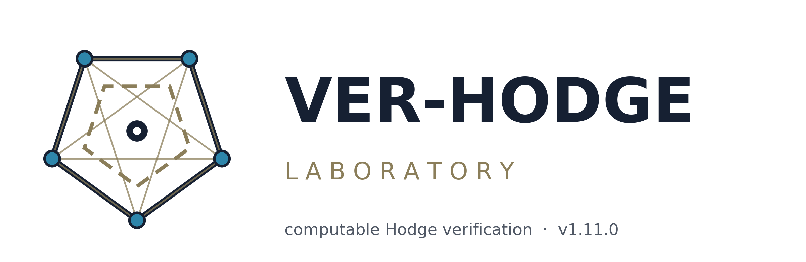
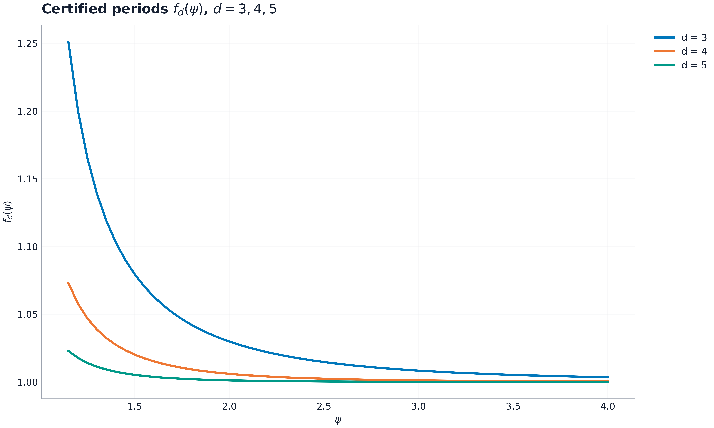
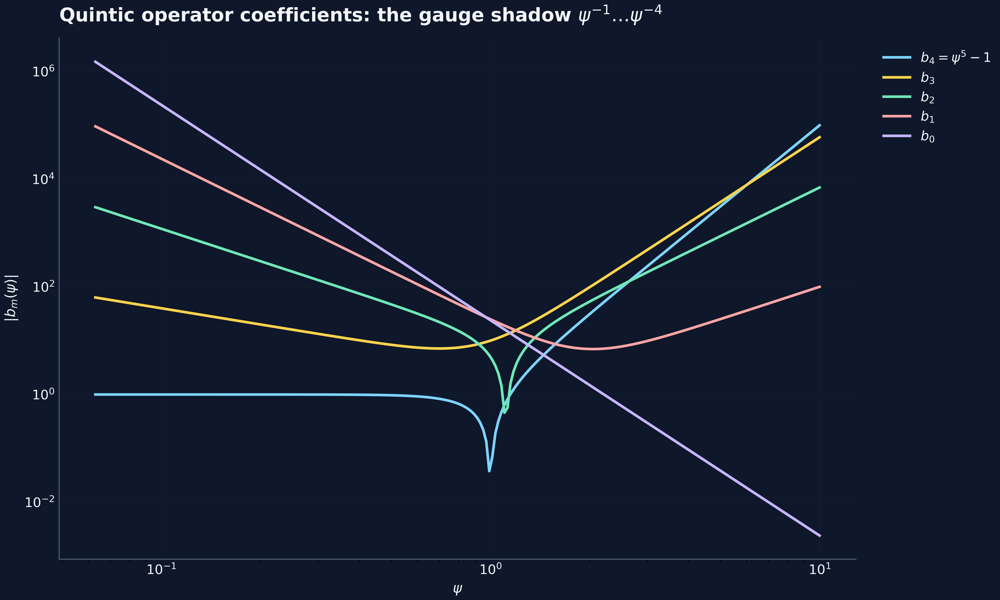
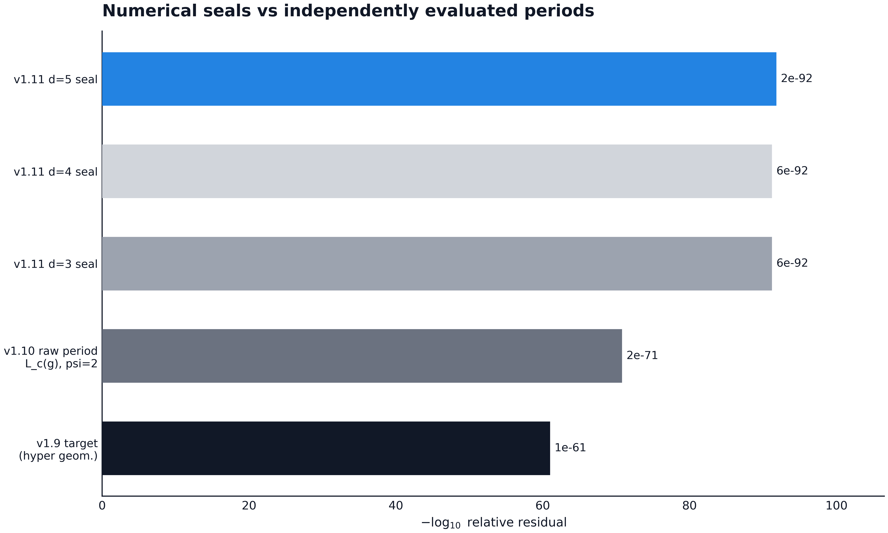

# VER-HODGE Laboratory

<div align="center">
  
</div>

<div align="center">


**VER-HODGE(C_i, p)** — polynomial-time, exact, explicit verification
of algebraic Hodge data with an asymmetric output contract:
**ALGEBRAIC CERTIFICATE** or **NOT-DETERMINED** — never a guess.

[ Монография EN ](monograph/VERHODGE_monograph_en.pdf) ·
[ Монография RU ](monograph/VERHODGE_monograph_ru.pdf) ·
[ Data appendix ](appendix/VERHODGE_data_appendix_v1.11.xlsx) ·
[ Figures 600 DPI ](figures/manifest.json)

</div>

---

## What is computed here (the v1.11 wave map)

| wave | deliverable | status |
|------|-------------|--------|
| v1.5–v1.8 | census, certificate K (N=11 resolvent), SNF engine (1,1,5,5,15,15,15,15) = 1125², K3 lattice (rank 20, (1,19)), Gross vol_h = 1125, HODGE-INPUT v1 end-to-end, the Dwork-pencil stand | computed |
| v1.9 | the certified ψ-form PF target (structural (ψ⁵−1) poles), the v1.8 target refuted (NE05), two cross-validated class-reduction engines on the full mod-p grid | computed |
| v1.10 | **the ψ-gauge theorem** L_true(ψg) = ψ·L_c(g): the mod-p derivation of the classical Picard–Fuchs operator is COMPLETE (C-012 closed); the descent certificate computed (C-017 resolved: the d(ι_R ξ) class is trivial) | computed |
| v1.11 | **the Dwork family at every Calabi-Yau degree** d = 3, 4, 5 (C-020): the general-d representation reduction + Krylov bridge + gauge land exactly on θ_z^{d−1} − z·Π(θ_z + j/d); five certification layers per degree (exact series annihilation, exact two-directional gauge identity, char-0 loop over Q, mod-p loops on p ≡ 1 (mod d) grids, ~10⁻⁹² hypergeometric seals); the tube-integral program registered with computed evidence (C-019 open, NE06 the homogeneous-Euler trap) | computed |
| v1.11 | **multilingual layer**: i18n catalogs (en/ru), `--lang` CLI; monographs EN/RU × PDF/DOCX; 60 figures at 600 DPI in 4 styles + tiles; the styled data-appendix workbook | computed |

Protocol output: `results/baseline_v15_v18.json` — **ALL CHECKS
PASSED** (V1, V13, K, V16, V17, V18, V19, V20, V21, V22, V23, V24).

## The figures (600 DPI, four styles + tiles)

| classic | dark |
|---|---|
|  |  |
| **mono** | **warm** |
|  |  |

*Every figure is generated by `scripts/make_figures.py` from the live
laboratory data — no hand-typed numbers.* (Русские подписи к тем же
рисункам — в русской монографии.)

## Quickstart

```bash
pip install -r requirements.txt        # sympy, numpy, mpmath, pyyaml
python -m verhodge.cli                 # full protocol (V1..V24)
python -m verhodge.cli --quick         # reduced grids
python -m verhodge.cli --lang ru       # ВСЕ ПРОВЕРКИ ПРОЙДЕНЫ
python -m pytest tests/ -q             # 53 tests
```

## The monographs (bilingual)

| | PDF | DOCX |
|---|---|---|
| 🇬🇧 English | `monograph/VERHODGE_monograph_en.pdf` (16 pp) | `monograph/VERHODGE_monograph_en.docx` |
| 🇷🇺 Русский | `monograph/VERHODGE_monograph_ru.pdf` (17 pp) | `monograph/VERHODGE_monograph_ru.docx` |

Both render the same content model: ten chapters (the decision
problem, the architecture, the Fermat family, the input grammar, the
Dwork pencil, the mod-p derivation, the general-degree family, the
tube program, falsifiability, reproducibility) plus five appendices.
The data appendix workbook carries twelve styled sheets computed from
the same artifacts.

## The asymmetric contract

A run ends in `ALGEBRAIC_CERTIFICATE` or `NOT_DETERMINED`.  The
parser never emits a verdict the input level cannot support; level-3
inputs and unsupported (kind, type) pairs dispatch to
NOT_DETERMINED — the falsifiable commitment enforced in code
(`verhodge/input_schema.py`), in Lean (`theorems/Lean/Verhodge/
Verhodge/Grammar.lean`, theorem `level3_never_certified`), and in
the claim registry (C-007).

## Layout (mirrors hodge-laboratory)

```
verhodge/        the engine: poly, census, cyclotomic, snf, lattice,
                 gross, dwork, gdreduce, input_schema, protocol, cli
claims/          registry.yaml — 15 claims with statuses and evidence
complexity/      ledger.yaml — bit-complexity accounting per subroutine
counterexamples/ the computed near-miss corpus (NE01..NE04)
inputs/          Level-0 executable JSON documents
verification/    emitted certificate artifacts
results/         baseline_v15_v18.json (the frozen reference)
theorems/Lean/   the Lean 4 layer (grammar, census, SNF spec)
polyglot/        C kernel (bit-identical) + rust slot
tests/           pytest suite (31 tests)
docs/            ROADMAP.md (the plan of record) + VERIFICATION.md
monograph/       the T21–T24 slots
```

## Run

```bash
pip install -r requirements.txt
python -m verhodge.cli            # the full protocol
python -m verhodge.cli --quick    # the fast subset
python -m pytest tests -q         # the test suite
bash polyglot/run_all.sh          # the C cross-check
```

## Reproduction contract

Every number in `results/baseline_v15_v18.json` is recomputed from
first principles on each run: Φ_n from the divisor product formula,
the minimal polynomials from the collapse in Z[ζ]/(Φ_n), the SNF
from the Kannan–Bachem engine, vol_h from the Γ-product at 120 dps,
the point counts from the meet-in-the-middle enumeration.  The only
frozen inputs are the *expected values* (the regression targets),
never the computations.
